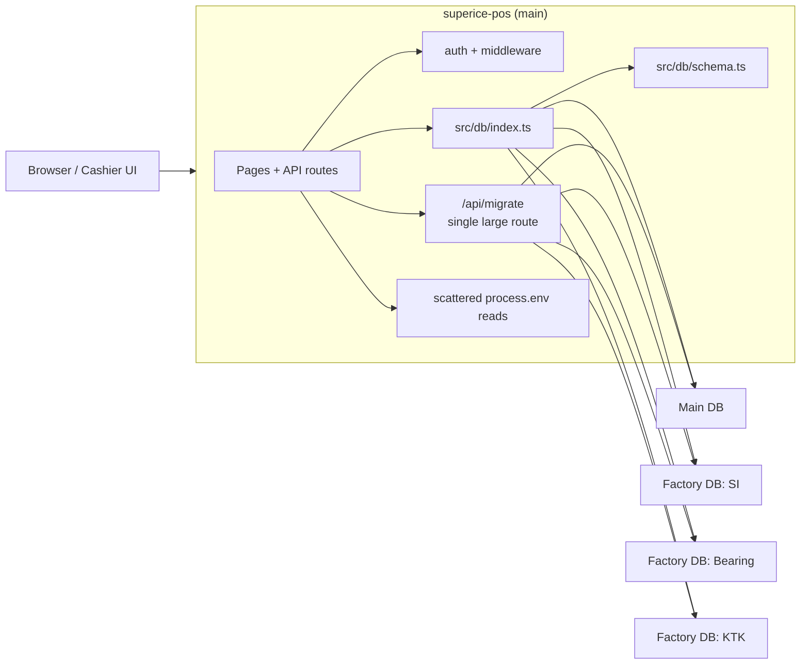
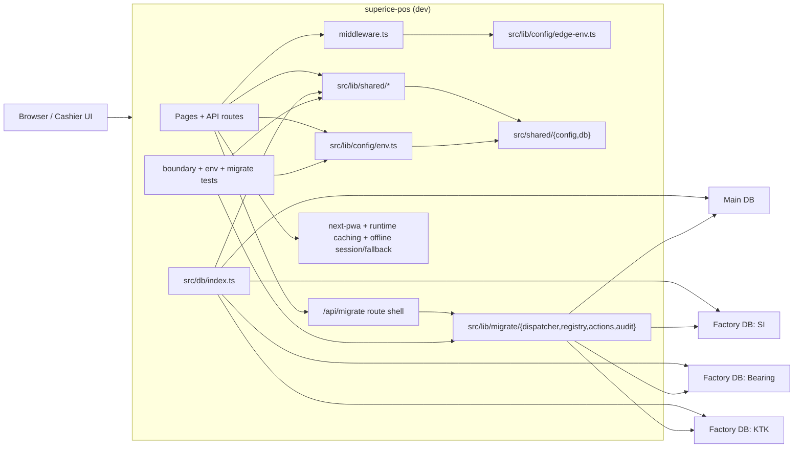

# `dev` Architecture Review

Status: historical branch-review snapshot

- This document is a branch review captured at a specific time on `dev`.
- It is useful as historical context for what changed during that refactor window.
- Do not use it as the primary current-state architecture source; use [../../docs/architecture/current-state.md](../../docs/architecture/current-state.md) and [shared-boundary.md](./shared-boundary.md) instead.

This document captures the current high-level architecture of the `dev` branch and how it differs from the older `main` shape.

## Validation Snapshot

Validated on `dev` at commit `5b94bd8`.

- `npm run lint` ✅
- `npm run test` ✅
- `npm run build:local` ✅
- `npm exec -- tsc -p tsconfig.json --noEmit` ✅
- `npm exec -- tsx scripts/push-schema.ts` with all `DATABASE_URL*` unset ✅
  - expected behavior: skips schema push cleanly when no DB env is configured

Not run as part of this review:

- `npm run build`
  - this executes `scripts/push-schema.ts` against configured databases and is a real schema-push operation
- full authenticated staging smoke tests

## Starting Architecture (`main`)

The old shape was mostly app-local and monolithic:

- `superice-pos` owned its own DB schema in `src/db/schema.ts`
- DB connection setup and factory routing logic lived directly in `src/db/index.ts`
- env access was spread through route handlers and libs
- `/api/migrate` was a very large single route with inlined operational logic
- no service-worker/offline runtime layer in `next.config.ts`
- no local `src/shared` boundary inside the standalone repo

## Reviewed Architecture (`dev` at the time of review)

At the time of this review, the `dev` branch kept `superice-pos` deployable as a standalone repo, but introduced a shared internal backend boundary inside the repo itself:

- the deploy-facing shared backend copy was vendored into `src/shared`
- hot paths consume that backend through thin local wrappers:
  - `src/lib/shared/*`
  - `src/lib/config/env.ts`
  - `src/lib/config/edge-env.ts`
- DB factory routing now depends on shared runtime primitives instead of app-local ad hoc setup
- env-heavy server routes use centralized accessors instead of direct `process.env`
- `/api/migrate` is now a route shell over dispatcher, registry, actions, and audit logging
- PWA/offline runtime is now part of the app boundary through `next-pwa`, `public/sw.js`, and `src/lib/pwa/runtime-caching.ts`
- guardrail tests enforce the local-boundary rule and raw-env restrictions

## What Improved

- The DB layer is cleaner. `src/db/index.ts` now consumes stable shared runtime helpers instead of owning all connection-setup details itself.
- The env story is much better. Server-side config resolution is centralized behind `src/lib/config/env.ts`, while middleware keeps a separate edge-safe path in `src/lib/config/edge-env.ts`.
- `superice-pos` is now standalone-deployable again. The `src/shared` vendored copy removes the parent-workspace dependency that would have broken Render builds.
- `/api/migrate` is structurally safer to work on. The route is no longer a single overloaded file.
- The branch has meaningful architectural guardrails: app-boundary, server-env-boundary, shared-env, runtime-caching, offline-fallback, and migrate-focused tests all passed.

## What Is Still Weak

- `src/shared` is a vendored copy, not a real package. This is a practical deployment fix, but it creates drift risk until a future `@superice/shared` package exists.
- `npm run build` is still coupled to schema mutation because it executes `scripts/push-schema.ts` before Next builds. That is operationally risky for CI/CD and should eventually be decoupled.
- `/api/migrate` is better structured, but it is still an operationally sensitive surface that can touch multiple databases.
- PWA assets are generated into `public/`, so the repo can accumulate noisy churn around service-worker files if that output is not managed carefully.

## Recommended Next Step

Treat `dev` as staging-ready after authenticated smoke tests, not automatically production-ready.

This section is preserved as review history. It is not a current release checklist.

Before merging to `main`, validate:

1. login + sale load
2. transaction create
3. invoice issue / pay / void
4. dashboard / reports / daily-ledger
5. safe `/api/migrate` read-only access
6. offline login + offline fallback behavior
